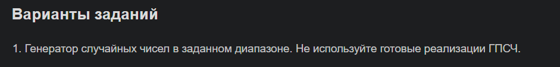
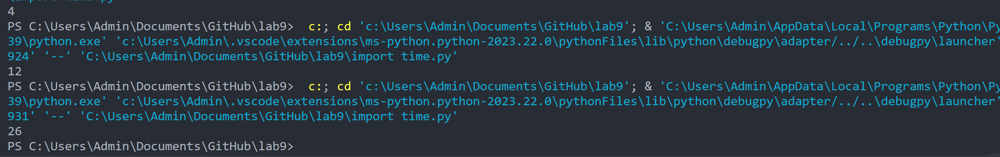

# PyProg

## Задание 
Сложность:
Rare
Решите задачу своего варианта.
Оформите отчёт в README.md. Отчёт должен содержать:
Условия задач
Описание проделанной работы
Скриншоты результатов
Ссылки на используемые материалы
## Отчет

## Этапы работы
### 1. Задание по Варианту №1




### 2. Код
```python
import time

def generate_random_number(min_val, max_val):
    # Используем текущее время для генерации случайного числа
    seed = int(time.time() * 1000)
    
    # Вычисляем псевдослучайное число 
    random_num = (seed % (max_val - min_val + 1)) + min_val
    
    return random_num

# Пример использования
min_value = 1
max_value = 100
random_number = generate_random_number(min_value, max_value)
print(random_number)
```

### 3. Результаты

### 4. Список использованных источников 
1. https://sky.pro/media/generacziya-sluchajnyh-czelyh-chisel-v-python/
2. https://ps.readthedocs.io/ru/latest/random.html
3. https://ru.hexlet.io/qna/python/questions/kakaya-funktsiya-nuzhna-dlya-generatsii-sluchaynogo-chisla-v-python
